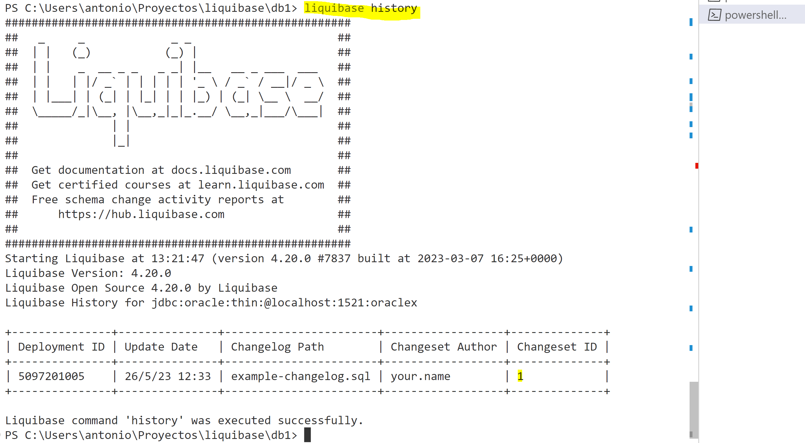
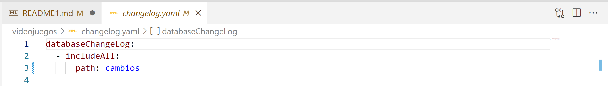
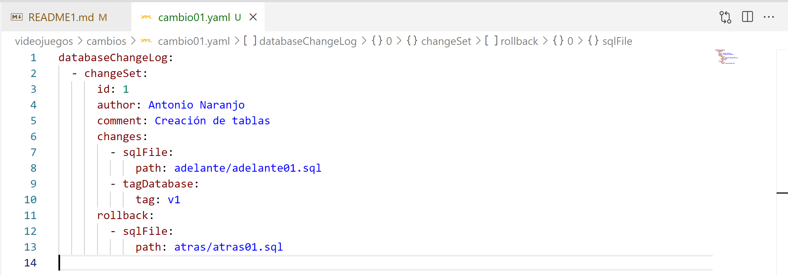
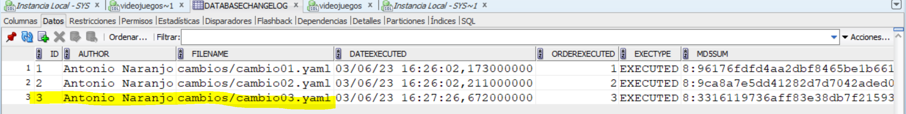

# Descripción del proyecto

Este proyecto consiste en la instalación de la herramienta de administración de base de datos llamada Liquibase. 
Una vez instalada se procedería a integrar Liquibase con una base de datos para poder así implementar cambios y movimientos en ella usando las posibilidades de la herramienta.
A su vez, crear un repositorio en Github donde se recoja todos esos movimientos y cambios producidos en la base de datos para que todo quede registrado.

# Introducción teórica

Liquibase es una herramienta de administración de base de datos escrita en java que proporciona una manera fácil de rastrear e implementar cambios en la base de datos.
Estos cambios pueden ser implementados a través de diversos tipos de lenguaje como pueden ser xml, sql, yaml, json…
Liquibase soporta 55 bases de datos, entre ellas servidor Mariadb, servidor MySQL, base de datos de Oracle, postgresql, apache cassandra…

# Instalación en Windows

Para la instalación de Liquibase, accedemos a su página oficial y nos descargamos la opción que más nos convenga.


Ejecutamos el fichero .exe y seguimos el asistente de instalacion hasta finalizar el proceso.
Una vez instalado, ejecutamos liquibase en cualquier consola.


# Como empezar un proyecto

Primero crearnos un usuario en Oracle y le damos privilegios.


Después iniciamos un proyecto con liquibase. Para ello escribimos el comando “liquibase init project”.


Al ejecutar el comando se crean unos ficheros automáticamente.


Después entramos en liquibase.properties y modificamos algunos parámetros.


Modificamos la URL (en este para Oracle), e indicamos usuario y contraseña indicada anteriormente.


# Tablas que crea liquibase

Para el correcto fucinamiento de liquibase, la herramienta crea dos tablas en la base de datos. 

- En databasechangelog se recogen los cambios que se aplican en la base de datos.

- Databasechangeloglock sirve para corroborar que solo una instancia de liquibase se está ejecutando.

Estas tablas las crea liquibase automáticamente al hacer el primer cambio en la base de datos.


# Despliegue de un cambio en una base de datos.

Para desplegar un cambio, tenemos que modificar el fichero .sql que se crea al iniciar un proyecto. Este fichero se conoce como changelog, y es el encargado de especificar los metadatos. También recoge los changeset, que son los cambios a realizar en la base de datos.

Además, podemos hacerlo de dos maneras diferentes:


Podemos ejecutar el .sql, ya que ahí está especificado tanto el changelog y el changeset en el mismo fichero.


Para ello, ejecutamos el comando 

```
liquibase update
```


Para comprobar si se han realizado los cambios especificados en el changelog, accedemos a sql developer y lo comprobamos.


# Aplicar tags manualmente

La finalidad de aplicar un tag a un changeset es la de crear una especie de version para así poder volver a ella si lo necesitamos. Liquibase aplica el tag al ultimo cambio cuando desplegamos.
Para ello, debemos ejecutar el siguiente comando.

```
liquibase tag --tag=1
```


# Rollback de un cambio en una base de datos.

Para hacer rollback, podemos ejecutar los siguientes comandos.

```
liquibase rollback --tag=numero de tag
```

```
liquibase rollbackcount --count=numero de pasos atrás
```


Si queremos volver atrás con el comando tag, desplegamos un nuevo cambio, y ejecutamos tag.


Si queremos volver atrás con count, hacemos el mismo proceso pero ejecutamos el comando para count.


# Comprobar el estado y el historial de cambios

Para comprobar el estado, ejecutamos el siguiente cambio.

```
liquibase status
```


Para comprobar el historial de cambios, ejecutamos el siguiente comando.

```
liquibase history
```




# Despliegue de una forma mas estructurada

Podemos desplegar cambios de una manera mas estructurada utilizando ficheros yaml y sql. 
Yaml lo podemos usar para definir los metadatos, y sql lo podemos utilizar para especificar los cambios.
Para ello, usamos el parámetro “includeall”, que sirve para indicar una ruta donde van a estar los ficheros a ejecutar.


Para especificar "includeall" lo hacemos de la siguiente forma usando ficheros yaml.




A continuación, creamos una carpeta con el nombre que le hemos especificado en `includeall` y dentro creamos un fichero yaml, especificando el metadato `changes`, `rollback` y  `sqlfile` para indicar la ruta donde se encuentran los cambios a desplegar. También le podemos añadir el metadato `tagDatabase` para indicarle una versión de la base de datos en el caso de que queramos hacer un rollback.




Después creamos otras dos carpetas.
En una de ellas especificaremos los cambios con extension .sql, y la otra carpeta será para especificar los rollbacks esos cambios.


Finalmente ejecutamos `liquibase update` y comprobamos que se han desplegado los cambios indicados.


# Despliegue de base de datos mariadb

Para crear cambios en mariadb, primero ejecutamos un contenedor con una base de datos mariadb

```
docker network create mariadb 
docker run --detach --network mariadb --name mariadb --env MARIADB_USER=antonio --env MARIADB_PASSWORD=antonio --env MARIADB_DATABASE=antonio --env MARIADB_ROOT_PASSWORD=peque -p 3306:3306 mariadb:latest
```

Después instalamos un cliente de base de datos llamado mysql workbench y creamos un usuario


Después iniciamos un proyecto que es practicamente igual que para oracle, excepto la jdbc url, que es diferente.

Ejecutamos `liquibase update` y ya estaría listo.


# Errores surgidos y como solucionarlos

## Aplicar un tag que no existe

Al hacer un rollback usando tag, liquibase si no encuentra el tag especificado, por lo que antes hay que crear el tag antes de ejecutar un cambio.


## Renombrar fichero o carpetas

Cuando se han aplicado cambios en un proyecto, y después se renombran las carpetas donde están los changesets, liquibase se desconfigura ya que la ruta donde están los cambios con extensión .sql se guardan en la tabla creada automáticamente `databasechangelog`.

Ejemplo: En este proyecto los cambios están en una carpeta que se llama cambios y todos ellos se han aplicado en la base de datos.


Si renombramos la carpeta a cambios2, aunque lo cambiemos en changelog.yaml


liquibase ya no reconoce que los cambios se han aplicado y dice que hay 3 pendientes (cambio01.yaml, cambio02.yaml, cambio03.yaml).


Además los update y los rollbacks fallan porque se intentan aplicar otra vez cuando esos cambios ya están aplicados.

Fallan porque liquibase piensa que por el cambio de nombre de la carpeta, los cambios son nuevos, pero no es así.


## Modificar un .sql que ya se ha aplicado

Cuando se aplica un cambio y vemos que se nos ha olvidado algo, si intentamos modificar el sql y hacemos update de nuevo, liquibase falla.

Ejemplo:

En este proyecto están todos los cambios aplicados



pero se nos ha olvidado un insert en adelante03.sql. Lo añadimos.


y volvemos a hacer `liquibase update`.


Falla pero no entiendo por qué. No encuentro información del por qué no puedo hacer cambios una vez aplicado cambios anteriormente. Sin embargo, si creo un changeset nuevo introducciendo ese cambio, si lo ejecuta.

## Realizar cambios manualmente en la base de datos

Si creo un cambio en sqldeveloper en una base datos


Y después creo un nuevo cambio y lo despliego


Liquibase falla porque la tabla ya está creada.


# Conclusiones

Liquibase es una herramienta muy útil para aplicar cambios de forma estructurada y ordenada para un administrador de sistemas. Es una buena herramienta para que un administrador y la persona que hace los cambios en la base de datos se comuniquen. Liquibase es una herramienta con grandes posibilidades y me gustaría seguir indagando en ella.

# Herramientas utilizadas

- Visual studio Code.
- Liquibase.
- SQL Developer
- Docker.
- MySQL Workbench.

# Referencias

- [Bases de datos soportadas:](https://www.liquibase.com/supported-databases?category=advanced,contributed,foundational)


- [Como empezar con liquibase:](https://alvaromonsalve.com/2022/03/14/liquibase/)

- [Conceptos de liquibase:](https://refactorizando.blog/tutorial-liquibase-como-utilizar-liquibase/)

- [1. Desplegar cambios con includeall y formato yaml:](https://docs.liquibase.com/concepts/bestpractices.html)

- [2. Desplegar cambios con includeall y formato yaml:](https://docs.liquibase.com/change-types/includeall.html)

- [3. Desplegar cambios con includeall y formato yaml:](https://www.adictosaltrabajo.com/2010/09/10/liquibase/)

- [4. Desplegar cambios con includeall y formato yaml:](https://www.theninjacto.xyz/Liquibase-Control-Versiones-DataBase-Refactoring/)

- [5. Desplegar cambios con includeall y formato yaml:](https://alvaromonsalve.com/2022/03/14/liquibase/)

- [1. Comando para especificar la ruta para desplegar cambios:](https://docs.liquibase.com/change-types/sql-file.html)

- [2. Comando para especificar la ruta para desplegar cambios:](https://docs.liquibase.com/workflows/liquibase-community/using-rollback.html)

- [Como poner parámetro tag en changeset (metadatos):](https://docs.liquibase.com/change-types/tag-database.html)

- [Docker mariadb](https://hub.docker.com/_/mariadb)

- [url mariadb](https://stackoverflow.com/questions/23020857/connect-to-mariadb-from-java-application-in-netbeans-on-linux-mageia)

- [crear tabla mariadb](https://styde.net/crear-y-eliminar-tablas-en-mysql-mariadb/)

- [Cliente mariadb](https://blogthinkbig.com/clientes-mysql-gratis-windows)
