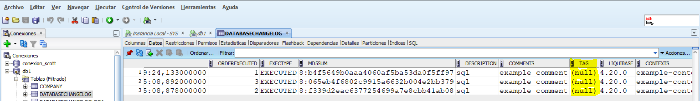

# Crear usuario en oracle
```
create user db1 identified by db1
default tablespace users
temporary tablespace temp
quota 50m on users;

grant all privileges to db1;
```

# Inicializar proyecto liquibase
```
liquibase init project
```

Borramos los ficheros loquibase flow

# Configurar conexión a base de datos

Modificamos liquibase.properties y especificamos la url, usuario y contraseña.
liquibase.command.url
liquibase.command.username
liquibase.command.password

La url es diferente para cada tipo de base de datos. El tipo de url se llama jdbc.

Concretamente para oracle tiene el siguiente formato:

```
jdbc:oracle:thin:@<ip>:<puerto>:<instancia>

```

# Especificar la ruta al fichero de cambios (changelog)

Modificamos liquibase.properties para especificar la ruta al fichero de cambios.
changeLogFile

Changelog es el fichero principal que contiene los cambios a aplicar a la base de datos.

# Formato SQL

Liquibase usa comentarios en SQL para especificar cambios.

El primer comentario siempre es

````
--liquibase formatted sql

````

Cada cambio se especificar de la siguiente manera:

````
--changeset your.name:1 labels:example-label context:example-context

```

--changeset sirve para indicarle a liquibase que cambios tiene que realizar.

your.name en donde ponemos la persona (administrador) que va a realizar el cambio. En este caso sería yo.

1 sería la version que tiene ese cambio.

labels sería para añadir etiquetas.

context es algo parecido a las etiquetas.

También podemos poner un comentario para explicar el cambio y por qué con:

```

--comment: example comment

```

Finalmente cada cambio SQL lleva obligatoriamente un rollback para volver al estado de la base de datos anterior. 


```

--rollback DROP TABLE person;

```

Para aplicar los cambios utilizamos el siguiente comando:

```
liquibase update
```

Para volver a una versión anterior:

```
liquibase rollback --tag=<version>
```

Al aplicar los cambios me doy cuenta que los tag son nulos, por lo que al aplicar el comando de rollback no puedo hacerlo.(Averiguar como hacer que tag se guarde).



En su lugar uso el siguiente comando:

```
liquibase rollback-count --count=<numero de cambios que quiero revertir>
```

